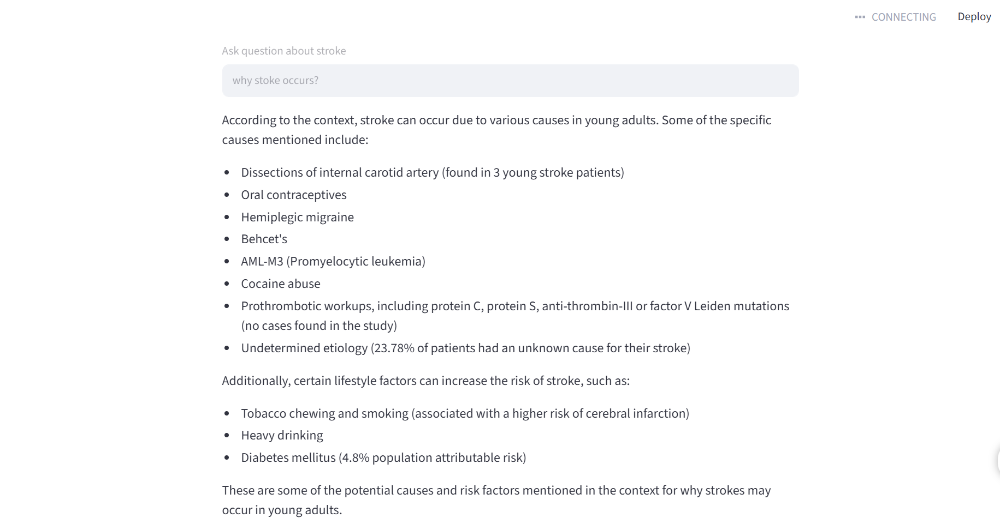

# Medical Research Assistant using RAG

## Overview

This project implements a Retrieval-Augmented Generation (RAG) system for medical literature analysis. Users can query medical research papers using natural language and receive grounded answers with source citations.

---

## Features

- PDF document ingestion
- Semantic search using embeddings
- ChromaDB vector database
- Llama 3/OpenAI integration
- Citation-based responses
- Streamlit user interface
- Medical literature question answering

---

## Application Demo

### User Query

Example Question:

```text
Why does stroke occur?
```

### Generated Response

The system retrieves relevant medical literature and generates evidence-based answers from the indexed documents.



---

## Architecture

```text
PDF Documents
      ↓
Document Loader
      ↓
Chunking
      ↓
Embeddings
      ↓
ChromaDB
      ↓
Retriever
      ↓
Llama 3 / OpenAI
      ↓
Answer + Citations
```

---

## Tech Stack

| Component | Technology |
|------------|------------|
| Language | Python |
| Framework | LangChain |
| Vector DB | ChromaDB |
| Embeddings | BAAI BGE |
| LLM | Llama 3 |
| UI | Streamlit |
| Document Processing | PyPDF |

---

## Installation

```bash
git clone https://github.com/sreemolcv/Medical_RAG_Assistant.git

cd Medical_RAG_Assistant

python -m venv venv

venv\Scripts\activate

pip install -r requirements.txt
```

---

## Run the Application

```bash
streamlit run app.py
```

---

## Example Questions

- Why does stroke occur?
- What are the major risk factors?
- What treatments are available?
- Summarize the findings of the study.

---

## Future Enhancements

- Hybrid Search (BM25 + Vector Search)
- Pinecone Integration
- RAGAS Evaluation
- Cross Encoder Re-ranking
- LangGraph Agentic Workflow
- Multi-document Reasoning

---

## Author

Sreemol C Vijayan
